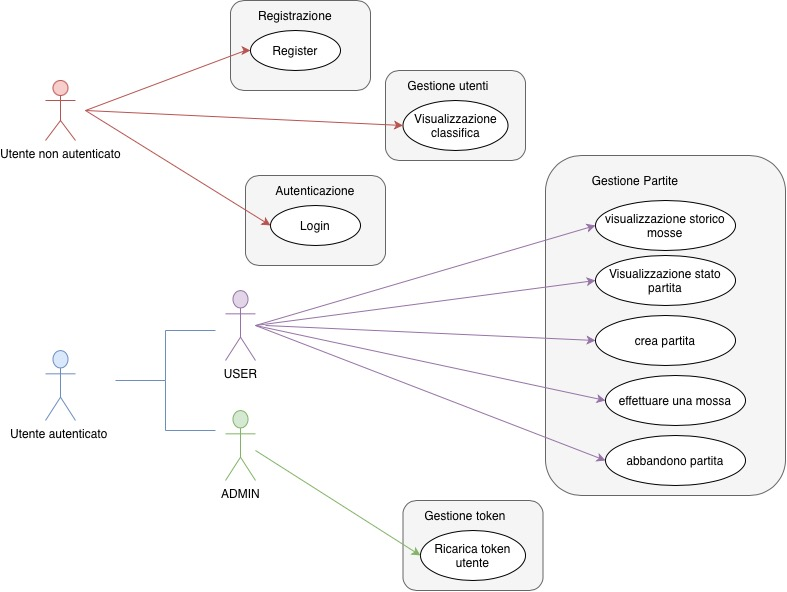
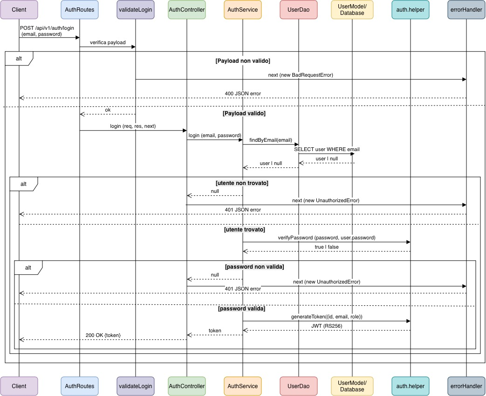
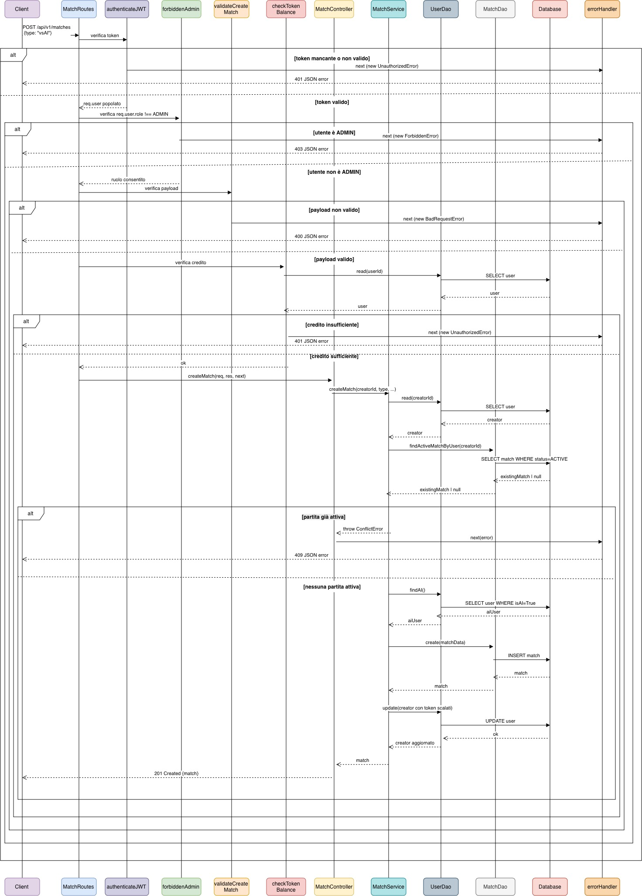
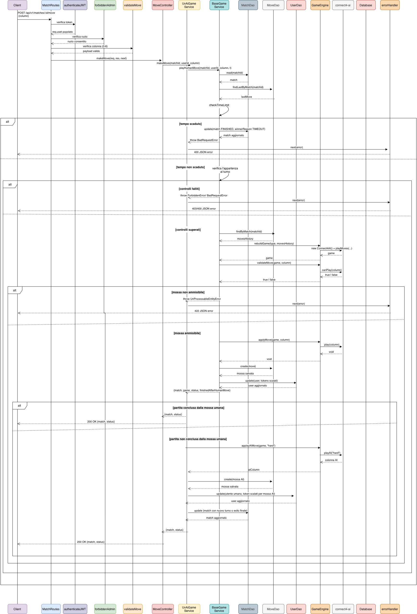
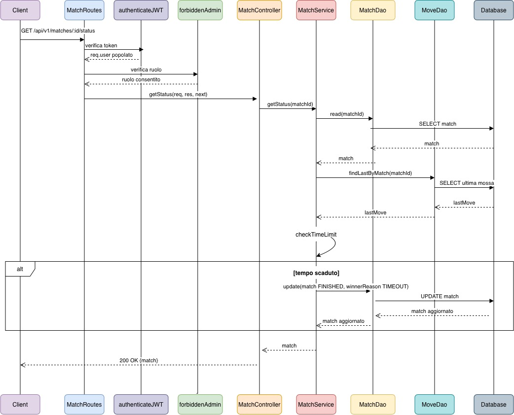
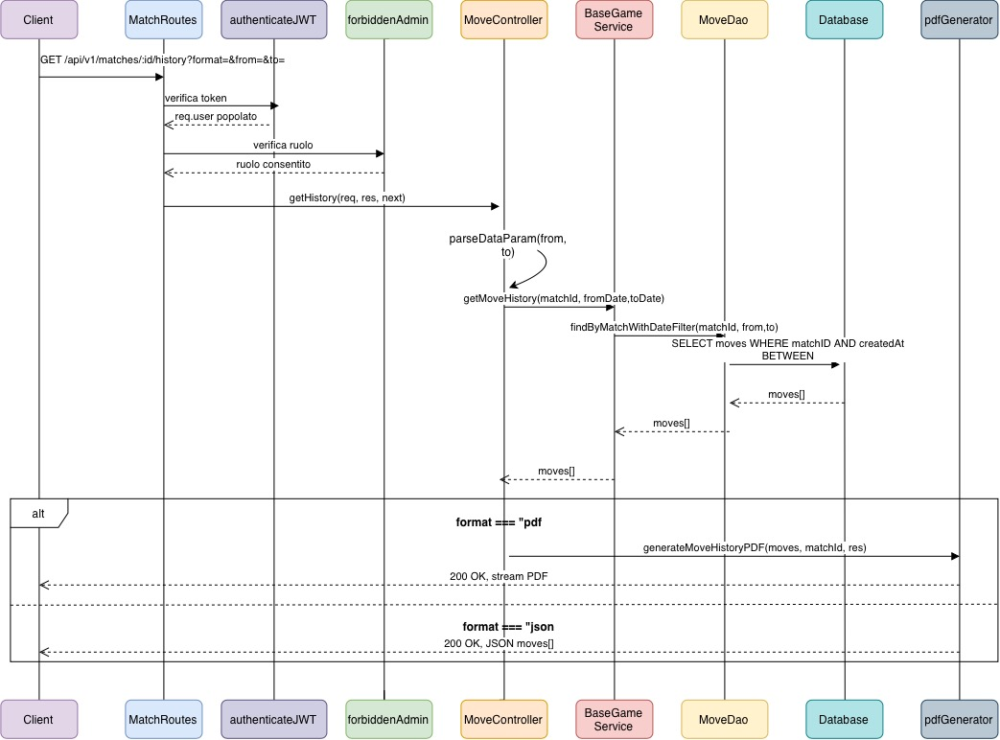
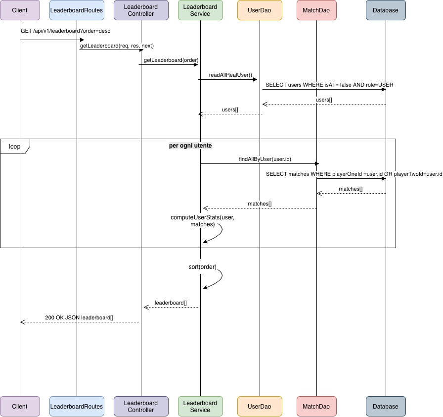
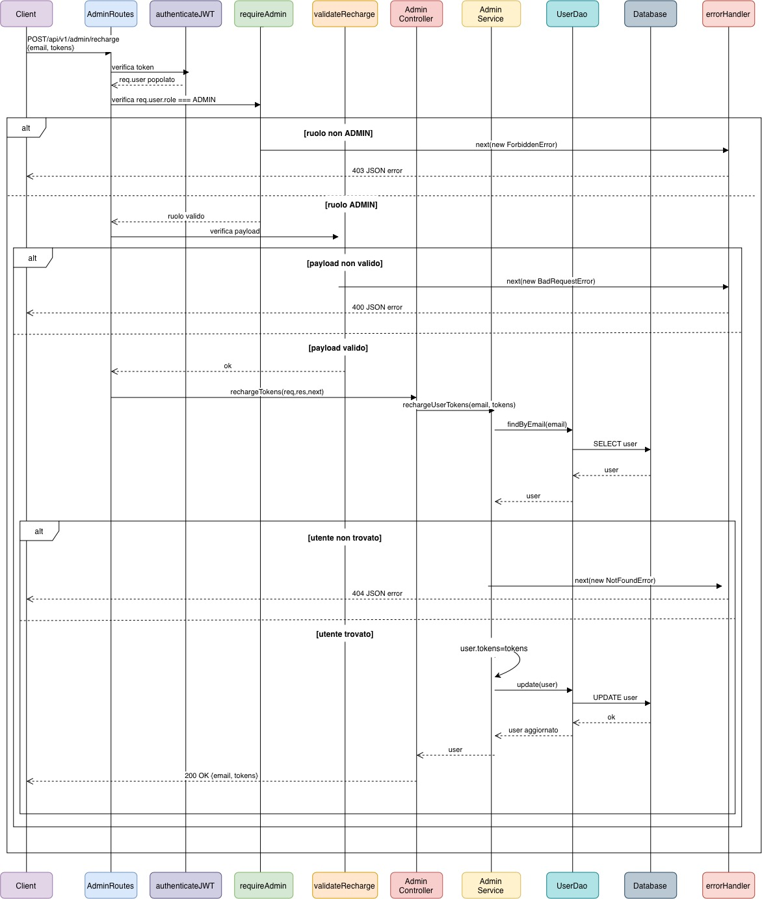
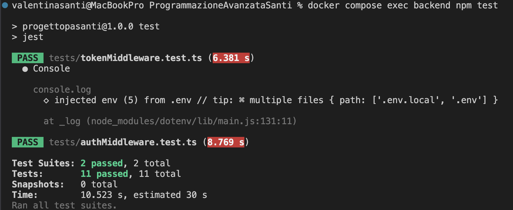

# Sviluppo di un Back-end per il gioco di Forza Quattro
Il seguente progetto è stato sviluppato nell'ambito dell'esame di **Programmazione Avanzata** per l'AA **2025/2026**, presso l'**Università Politecnica delle Marche**, all'interno del corso di Laurea Magistrale in **Ingegneria Informatica e dell'automazione**.

Il progetto propone un sistema backend per la gestione del gioco di **Forza Quattro**, prevedendo sia sfide User VS User che sfide User VS AI.

Il sistema supporta la presenza di più partite contemporaneamente, garantendo però che ciascun utente possa partecipare attivamente ad una sola partita alla volta.

Attraverso il backend viene gestito l'intero ciclo di vita della partita: registrazione degli utenti, autenticazione dell'utente, controllo del credito token, creazione della partita, esecuzione delle mosse, aggiornamento dello stato, salvataggio dello storico, abbandono delle partite, visualizzazione dello storico delle partite di un match e visualizzazione della classifica degli utenti.

L'applicazione è stata sviluppata utilizzando **Node.js**, **Typescript**, **Express**, **Sequelize** e **PostgreSQL**. Per la logica di gioco e la generazione delle mosse da parte dell'AI è stata utilizzata la libreria **connect4-ai**. Per quanto la generazione del file PDF è stata utilizzata la libreria **PDFkit**. L'autenticazione degli utenti è stata basata su **JWT** con schema di firma asimmetrico RS256; la chiave privata è stata memorizzata nel file `.env`. L'ambiente di esecuzione è stato predisposto utilizzando **Docker** e **Docker Compose**. Per l'esecuzione dei test automatici è stato utilizzato **Jest** mentre per effettuare dei test manuali dell'API è stato utilizzato **Postman**

Dal punto di vista progettuale, il backend segue un'architettura a livelli:

```text
Routes -> Middleware -> Controller -> Service -> DAO -> Model
```
La logica di gioco vera e propria (validazione mosse, rilevamento vittoria, calcolo della mossa AI) è delegata alla libreria esterna `connect4-ai`, incapsulata in un modulo dedicato (`utils/gameEngine.ts`) che isola il resto del sistema dai dettagli implementativi della libreria.

---

## Obiettivi del progetto

L'obiettivo principale del progetto è la realizzazione di un backend REST per la gestione del gioco di **Forza Quattro**, sviluppato secondo le specifiche dell'esame di **Programmazione avanzata**.

Il sistema sviluppato permette agli utenti autenticati di giocare due modalità di partita differenti:
- **UvU**: partita tra due utenti reali;
- **UvAi**: partita tra un utente reale e un avversario gestito automaticamente dal sistema.

Il backend deve inoltre garantire una corretta gestione degli utenti, delle partite, del credito token, dello stato del gioco e dello storico delle mosse, mantenendo la coerenza dei dati anche durante operazioni complesse.

Gli obiettivi specifici del progetto sono:
- implementare un sistema di **autenticazione tramite JWT** in modo da proteggere le rotte riservate agli utenti autenticati;
- prevedere la presenza di due tipologie di utenti `USER` e `ADMIN`, oltre all'utente fittizio `AI` creato per la gestione delle mosse nelle partite UvAi;
- consentire agli utenti di tipo `USER` di creare partite, effettuare mosse, abbandonare partite, visualizzare lo storico delle mosse;
- consentire agli utenti di tipo `ADMIN` di ricaricare il credito token degli utenti;
- gestire il **credito token**, la creazione della partita ha un costo differenziato a seconda che la partita sia User Vs User o User Vs AI, inoltre ogni mossa eseguita comporta un costo che nel caso di partita vsAI viene addebitato all'utente creatore del match per le mosse dell'AI;
- impedire che un utente possa avere attive più partite contemporaneamente ad eccezione dell'utente Ai, che può partecipare contemporaneamente a più partite;
- supportare la creazione di partite tra utenti reali mediante la modalità **UvU**;
- supportare la creazione di partite tra un utente reale e l'AI mediante la modalità **UvAi**;
- gestione automatica delle mosse dell'AI nelle partite **UvAi**;
- salvare lo storico delle mosse di una partita garantendo la possibilità di selezionare il periodo di cui si è interessato, inoltre è possibile scegliere tra file JSON e file PDF;
- mantenere aggiornato lo **stato delle partite**, compreso turno corrente, vincitore, motivo della conclusione della partita;
- gestione dell'abbandono di una partita e assegnazione del vincitore;
- validare i payload delle richieste tramite middleware dedicati, prima che raggiungano la logica di business;
- esporre una rotta pubblica (priva di autenticazione) per la visualizzazione della classifica, ordinabile in modo crescente o decrescente per punteggio;
- consentire l'impostazione di un limite di tempo massimo per effetuare una mossa, con conclusione automatica della partita in caso di superamento (o senza limiti se non specificato);
- inpedisce agli utenti di tipo ADMIN di partecipare alle partite, riservando loro esclusivamente la gestione della ricarica del credito token
- centralizzazione degli errori tramite middleware.

---

## Struttura del progetto
Il progetto è organizzato seguendo un'architettura a livelli, con una separazione chiara tra gestione delle rotte, middleware, controller, logica applicativa, accesso ai dati e modelli del database.

La struttura principale del progetto è la seguente:

```text
.
├── src/
|   ├── controllers/
|   ├── dao/
|   ├── db/
|   ├── enum/
|   ├── middlewares/
|   ├── models/
|   ├── routes/
|   ├── seed/
|   ├── services/
|   ├── types/
|   ├── utils/
|   ├── app.ts
|   ├──server.ts
├── tests/
|
├── .env
|
├── .dockerignore
|
├── .gitignore
|
├── docker-compose.yml
|
├── Dockerfile
|
├── package-lock.json
|
├── package.json
|
├── README.md
|
├── docs/
|   ├── exploration
|
├── tsconfig.json
|
├── jest.config.js
|
├── postman/
```
---

## Pattern utilizzati
All'interno del progetto sono stati utilizzati diversi pattern architetturali e progettuali per organizzare il codice in modo modulare, leggibile e manutenibile.

In particolare l'utilizzo dei pattern ha permesso di separare la responsabilità tra le varie parti del backend, evitando di concentrare la logica in un unico punto e rendendo eventuali modifiche più semplici da effettuare.

I pattern e principi applicativi utilizzati sono:
- Model-Controller-Service;
- DAO;
- Singleton;
- Strategy;
- Adapter;
- Gerarchia di eccezioni personalizzate;
- Chain of Responsability.

### Model-Controller-Service
Si tratta di un pattern architetturale utilizzato nello sviluppo di applicazioni backend modulari. Rappresenta una variazione al classico pattern MVC (Model View Controller) di cui mantiene i vantaggi, adattandoli ad un'archittetura del backend basata su API REST. 
L'attenzione viene posta sulla gestione delle richieste HTTP, sulla logica applicativa e sull'iterazione con il database.

All'interno del progetto di **Forza Quattro** questo pattern è stato applicato attraverso tre componenti principali: 
- **Model**: rappresenta la struttura dati dell'applicazione. Contiene le classi Sequelize che definiscono lo schema delle tabelle PostgreSQL, i tipi di dato e le relazioni tra le entità.
- **Controller**: è responsabile delle richieste HTTP e funge da intermediario tra il client e la logica applicativa. Si occupa dell'invio della richiesta HTTP, della lettura di eventuali parametri, body e informazioni dell'utente autenticato, e inoltra i dati necessari al service corrispondente. Restituiscono risposte nel formato atteso (JSON o PDF).
- **Service**: è la componente in cui risiede la logica di business dell'applicazione. 

#### Model
I modelli che troviamo nel progetto sono:
- User;
- Match;
- Move.

Il modello User rappresenta gli utenti registrati nel sistema, contiene informazioni come email, password cifrata, ruolo, credito token residuo e flag identificativo dell'utente fittizio AI.

Il modello Match rappresenta una parita, contiene informazioni come tipologia di partita, giocatori coinvolti, stato della partita, turno corrente, vincitore, motivo della conclusione della partita e limite temporale per eseguire una mossa.

Il modello Move rappresenta la singola mossa effettuata, contiene la partita di riferimento, il giocatore che l'ha eseguita e la colonna scelta.

#### Controller
Nel progetto sono presenti i controller dedicati alle principali aree funzionali:
- AuthController;
- MatchController;
- MoveController;
- LeaderboardController;
- AdminController.

Ad esempio, il MatchController non contiene al suo interno direttamente la logica per creare la partita, verificare il credito disponibile o determinare l'avversario, ma delega queste operazioni ai service dedicati.

#### Service
Nel progetto i service principali sono:
- AuthService;
- BaseGameService;
- UvUGameService;
- UvAiGameService;
- LeaderboardService;
- MatchService.

All'interno dei servizi vengono gestite le operazioni più complesse come:
- autenticazione dell'utente e generazione del JWT token;
- controllo del credito token;
- creazione delle partite e verifica del numero di partite attive per utente (massimo una);
- gestione delle mosse e validazione tramite la libreria di gioco;
- verifica della vittoria e assegnazione del vincitore;
- gestione dell'abbandono della partita;
- calcolo della classifica.

Per quanto riguarda la logica di gioco, il progetto è stato sviluppato utilizzando un service base `baseGameService` che contiene le funzioni comuni alle partite UvU e UvAi. Nei servizi `UvUGameService` e `UvAiGameService` sono poi state create le specializzazioni dei comportamenti in base alle modalità di gioco.

### DAO
Il **DAO** (Data Access Object) è un pattern strutturale con lo scopo di isolare la logica di accesso al database dal resto dell'applicazione.

Nel progetto, il DAO rappresenta il livello più vicino ai modelli Sequelize e si occupa delle operazioni concrete sulle entità persistenti.

I DAO presenti nel progetto sono:
- UserDao;
- MatchDao;
- MoveDao;

È inoltre presente un'interfaccia generica che consente di definire un contratto comune per le operazioni di accesso ai dati, rendendo il codice più ordinato e più facilmente estendibile. Ogni DAO oltre ai metodi generici estende metodi specifici del dominio.

Si evidenzia che all'interno dei DAO non è contenuta la logica applicativa che è di competenza dei Service.

### Singleton
Il **Singleton** è un pattern creazionale che garantisce l'esistenza di una sola istanza di una risorsa condivisa durante l'intero ciclo di vita dell'applicazione.

All'interno del progetto viene utilizzato per la configurazione della connessione al database (`src/db/database.ts`), tramite un costruttore privato e un metodo statico `getInstance`.
Questa istanza viene importata e riutilizzata in tutti i modelli, evitando la creazioni di connessioni multiple non necessarie e centralizzando le configurazioni.

### Adapter
L'**Adapter** è un design pattern strutturale che permette a oggetti con interfacce incompatibili di
collaborare. In particolare questo pattern risulta molto utile in situazioni, come accade nel progetto, in cui si deve adattarre l'interfaccia di una componente esistente a quella del resto del sistema.

Nel progetto è stato utilizzato questo pattern nel modulo `utils/gameEngine.ts` che incapsula l'utilizzo della libreria esterna `connect4-ai`, scritta in Javascript e priva di interfaccia TypeScript. In particolare il modulo espone funzioni orientate al dominio applicativo nascondendo i dettagli interni della libreria ai Service che la utilizzano. L'utilizzo di questo pattern consente, in caso di sostituzione della libreria di gioco, di dover modificare un solo modulo isolato.

### Gerarchia di eccezioni personalizzate
Nel progetto è stata definita una gerarchia di classi di errore, con una classe base `ApiError` e sottoclassi specifiche per ogni tipologia di errore applicativo:
- `BadRequestError` (400);
- `UnauthorizedError` (401);
- `ForbiddenError` (403);
- `NotFoundError` (404);
- `ConflictError` (409);
- `UnprocessableEntityError` (422);
- `InternalServerError` (500);

Ogni classe associa automaticamente il proprio status code HTTP (tramite libreria `http-status-codes`), evitando di gestire manualmente i codici numerici.

Nel caso fosse necessario aggiungere un nuovo tipo di errore, è sufficiente estendere `ApiError` con una nuova sottoclasse, senza modificare service o middleware esistenti.

### Chain of Responsability
Il **Chain of Responsability** è un design pattern comportamentale che consente di far attraversare una richiesta a una catena di handler, ciascuno dei quali può elaborarla, bloccarla o passarla al successivo.

Nel progetto questo pattern viene applicato tramite il sistema di middleware di Express. Di seguito viene riportato un esempio di flusso per la creazione di una partita:
``` text
POST/api/v1/matches
        ↓
authenticateJWT
        ↓
validateCreateMatch
        ↓
checkTokenBalance
        ↓
MatchController.createMatch

```
Sono presenti middleware dedicati a:
- **autenticazione** (`authenticateJWT`): verifica un JWT valido firmato con schema RS256;
- **autenticazione** (`requireAdmin`): controlla il ruolo dell'utente per le rotte riservate agli admin;
- **esclusione admin** (`forbiddenAdmin`): controlla il ruolo dell'utente impedendo l'accesso all'ADMIN per le rotte riservate agli utenti di tipo USER;
- **validazione** (`validatorMiddleware.ts`): verifica la correttezza sintattica dei payload tramite  `express-validator`, prima che i dati raggiungano la logica di business;
- **controllo credito** (`checkTokenBalance`): verifica che l'utente abbia il credito necessario per creare una nuova partita;
- **gestione errori** (`errorHandler`): intercetta ogni errore sollevato prima di `next(error)` e restituisce una risposta JSON coerente al client. 

### Riepilogo dei pattern utilizzati
|Pattern | Applicazione nel progetto | Motivazione |
|---|---|---|
|Model-Controller-Service| Intero progetto| Separare la gestione delle richieste HTTP (Controller) dalla logica di business (Service) e dalla struttura dati (Model). In questo modo il codice è più leggibile e permette di modificare un livello senza impattare gli altri.  |
|DAO | `src/dao/` | Isolando l'accesso ai dati dalla logica applicativa viene consentito di modificare le modalità del database senza toccare i Service, e tramite l'interfaccia `IDao<T>` viene garantito un contratto uniforme tra le entità del sistema.|
|Singleton | `src/db/database.ts`| Garantisce un'unica istanza di connessione Sequelize condivisa con tutta l'applicazione evitando connessioni multiple non necessarie. Viene centralizzata la configurazione del database in un unico punto.|
|Adapter | `src/utils/gameEngine.ts` | Viene utilizzato  per incapsulare l'utilizzo della la libreria `connect4-ai` (scritta in Javascript) in un modulo dedicato permettendo di esporre le funzioni in maniera coerente con il resto del sistema e di isolare l'impatto di un'enventuale sostituzione della libreria a un solo modulo |
|Gerarchia di eccezioni personalizzatta | `src/utils/errors.ts` |Rende il codice più leggibile rispetto alla gestione manuale dei codici numerici e centralizza la logica di traduzione errore-risposta |
|Chain of Responsability | `src/middlewares/` | Evita la duplicazione degli stessi controlli in più controller e permette di utilizzare gli stessi middleware su rotte diverse. |
---

## Rotte API
|HTTP | Endpoint | Descrizione | JWT | Ruolo|
|---|---|---|---|---|
|POST|`/api/v1/auth/register` |Registrazione nuovo utente| ❌ ||
|POST|`/api/v1/auth/login` |Login e generazione JWT| ❌ ||
|POST|`/api/v1/matches` |Creazione nuova partita (UvU o UvAi)| ✅ |User|
|POST|`/api/v1/matches/:id/move` |Esecuzione di una mossa| ✅ |User|
|POST|`/api/v1/matches/:id/abandon` |Abbandono di una partita| ✅ |User|
|GET|`/api/v1/matches/:id/status` |Stato corrente di una partita| ✅ |User|
|GET|`/api/v1/matches/:id/history` |Storico delle mosse (JSON o PDF, filtro per data)| ✅ |User|
|GET|`/api/v1/leaderboard` |Classifica pubblica (ordinabile) | ❌ ||
|POST|`/api/v1/admin/recharge` |Ricarica token di un utente| ✅ |Admin|

---

## Diagrammi UML

### Diagramma dei casi d'uso


### Diagrammi delle sequenze 
#### Login


#### Creazione partita vsAi


#### Esecuzione mossa


#### Abandono partita


#### Stato partita


#### Storico mosse


#### Classifica


#### Ricarica token


---
## Test del progetto tramite chiamate con Postman
Il progetto include una Collection Postman con Enviroment dedicato, disponibile nella cartella `postman/` del repository, contenente tutte le richieste necessarie a testare l'intero flusso applicativo, inclusi i casi di errori attesi.

### Esempio di utilizzo: Creazione di una partita contro l'IA
#### Endpoint
POST/api/v1/matches
#### Autenticazione
Richiede un JWT valido nell'header `Authorization: Bearer <token>`.
#### Parametry nel body
#### Esempio di richiesta (Postman)
#### Esempio di Risposta

### Esempio di utilizzo: Esecuzione di una mossa
#### Endpoint
POST/api/v1/matches
#### Autenticazione
Richiede un JWT valido nell'header `Authorization: Bearer <token>`.
#### Parametry nel body
#### Esempio di richiesta (Postman)
#### Esempio di Risposta

### Esempio di utilizzo: visualizzazione della classifica
#### Endpoint
POST/api/v1/matches
#### Autenticazione
Richiede non richiede autenticazione
#### Parametry nel body
#### Esempio di richiesta (Postman)
#### Esempio di Risposta
--- 
## Test del progetto tramite Jest
Il progetto include test automatici fatti con **Jest**, focalizzati sui middleware applicativi. I test verificano il comportamento dei componenti in isolamento, senza dipendere da un database reale o da chiavi JWT effettive, tramite l'uso di mock.
### Struttura dei test
``` text
tests/
|   ├── authMiddleware.test.ts
|   ├── tokenMiddleware.test.ts
```
### Middleware testati
- **authenticateJWT**: verifica che una richiesta priva dell'header `Authorization` o con token non valido/scaduto venga rifiutata con errore `UnauthorizedError`, e che un token valido popoli correttamente `req.user` permettendo alla richiesta di proseguire.
- **requireAdmin**: verifica che un utente con un ruolo diverso da `ADMIN` venga bloccato con un errore `ForbiddenError` e se con il ruolo corretto la richiesta possa proseguire.
- **checkTokenBalance**: verifica che il controllo del credito blocchi correttamente le richieste quando l'utente non è auttenticato, non esiste nel db, o non ha un credito sufficiente e che le lasci proseguire quando il credito è adeguato.

### Uso dei mock
Per isolare i middleware dalle reali dipendenze esterne, i moduli `auth.helper.ts` e `user.dao.ts` sono stati sostituiti tramite `jest.mock()`.

### Esecuzione dei test
```bash
npm test
```
oppure all'interno del container Docker:
```bash
docker compose exec backend npm test
```
### Risultati
Di seguito è riportato l'esito dei test


## Configurazione e uso
### Prerequisiti
Per eseguire il progetto correttamente è necessario avere installati:
- **Node.js**
- **npm**
- **Docker**
- **Docker Compose**

### Variabili di ambiente
Il progetto utilizza un file `.env` nella root del progetto per la gestione delle variabili di ambiente. 
Il file deve avere il seguente contenuto popolato opportunamente per il proprio ambiente di sviluppo.
``` text
POSTGRES_DB=
POSTGRES_USER=
POSTGRES_PASSWORD=
POSTGRES_PORT=
BACKEND_PORT=
JWT_PUBLIC_KEY=
JWT_PRIVATE_KEY=
```
Si ricorda che tale file non deve essere caricato su Git, in quanto contiene informazioni sensibili come le chiavi JWT.

### Avvio con Docker Compose
Per avviare il progetto con Docker Compose, posizionarsi nella root del progetto ed eseguire:
```bash
docker compose up --build
```
Una volta avviato il backend sarà disponibile all'indirizzo
```text
http://localhost:3000
```
### Arresto del container
Per fermare il container:
```bash
docker compose down
```

### Inizializzazione del database
Per testare il sistema con dati già pronti è disponibile uno script `seed.ts` che crea:
- Due utenti di tipo User
- L'utente Admin
- L'utente fittizzio che rappresenta l'AI

## Autori
